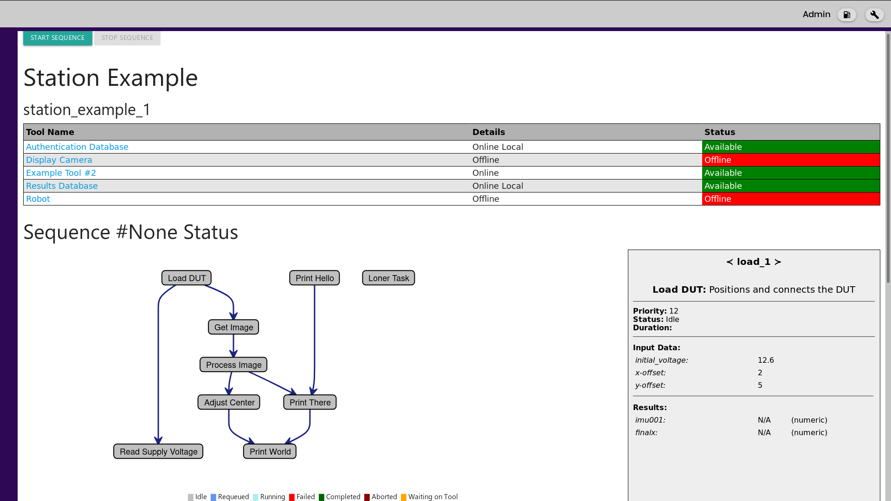
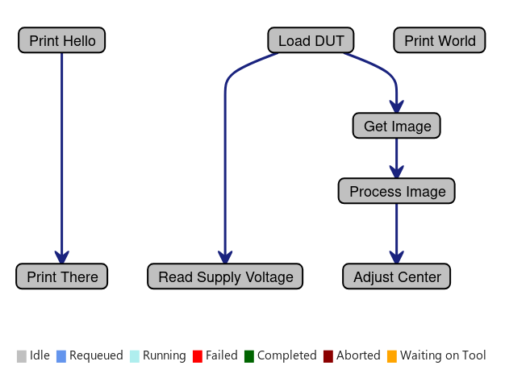

Welcome
=======
Welcome to Station Executive! Station Executive (stationexec) is a light-weight, flexible, automation
software framework to facilitate sequencing and interacting with external data sources in a manufacturing environment.
It is especially well suited for automating task execution, assembly, and testing. Stationexec is inherently network
ready, allowing derived stations to easily create or join a complex networked environment.

The 'Station' in Station Executive is meant to invoke the metaphor of a train station. Each 'Station' is a stop along
the way to a final destination in a journey. The framework is to be used to create these 'stations' that will automate,
assemble, test, and more in any manufacturing-related context. The network-readiness of stationexec allows each
individual station to be orchestrated by an external system to create a fully-automated system.

This developer guide walks through how to install, setup, develop, test, and deploy a customized instance of stationexec
replete with tools, a UI, a web API, databased storage, and more.

Anatomy
-------
Stationexec is comprised of three primary components: the stationexec core library, stations, and tools.

A deployment of stationexec on a system will look like a 'stations' and 'tools' folder inside of some master folder
in user space (called 'stationexec' for demonstration purposes). Each of the 'stations' and 'tools' folders will
contain all of the necessary station and tool definitions for an instance of the deployed station type (explored below).

A full tree for example::

    stationexec/
    ├── stations
    │   ├── __init__.py
    │   ├── example
    │   │   ├── __init__.py
    │   │   ├── operations.json
    │   │   ├── operations.py
    │   │   ├── station.json
    │   │   ├── station.py
    │   │   ├── tool_manifest.json
    │   │   └── ui
    │   │       └── example_ui.html
    │   └── ...
    ├── tools
    │   ├── __init__.py
    │   ├── example_tool
    │   │   ├── example_tool.py
    │   │   ├── __init__.py
    │   │   └── ui
    │   │       └── example_tool_control.html
    │   ├── robot
    │   │   ├── __init__.py
    │   │   ├── robot.py
    │   │   └── ui
    │   │       └── robot_control.html
    │   └── ...
    ├── example.json
    └── <identifier>.json

To run the example station as shown in this example, execute from command line from this folder (--localonly flag is
used to disable remote database access, as it is generally not configured at the early stages of development)::

    stationexec -f example.json --localonly -p 8888

The UI for this station could then be viewed at http://localhost:8888

stationexec core library
^^^^^^^^^^^^^^^^^^^^^^^^
The stationexec core library is provided as a Python .whl library that can be installed using pip. This library is a
versioned, self-contained package with all core functionality and features. This includes:

    * The Sequencer - handles multi-threaded execution of prioritized operations with dependencies.
      Operations written by the station creator will be loaded by the sequencer, ordered according to critical path,
      priority and dependency, then executed.
    * The Toolbox - manages tool connectivity and access control. It loads and initializes all defined tools and
      maintains connectivity, resources, and health for each tool. Access to each resource is through the toolbox
      to maintain order in a multi-threaded environment.
    * The UI - many components have customizable user interfaces to allow interaction with the station, both for
      control and visualization. The base user interface is built-in to the library, allowing station authors to create
      simple HTML modules for each component that will automatically be incorporated into the system at large.
    * The Server - primary functionality of stationexec is exposed via REST interfaces to allow for natural interaction
      in a networked context. Stationexec can provide data and be controlled over these interfaces. An author can
      also easily create new endpoints to extend functionality to the station and tools.

The core library itself will not require editing by the author when designing new stations and tools.

Stations
^^^^^^^^
A Station is a deployed instance of stationexec that manages a system used for automation, assembly, test, or processing
of any kind. A station can be as simple or complex as required - there are no minimum or maximum specifications for what
a system is able to accomplish.

In practice, a station definition is simply a folder that contains all of the necessary files that give a station its
identity. Each station folder is self-contained and can co-exist with any number of other station definitions in the
'stations' folder.

A new station definition template can be created by using the `se-gen` CLI tool. This will create a station folder
filled with template files for a station that the author can then edit to meet their needs (see the `CLI Utilities`
section of this guide for more details, usage instructions, and other helpful utilities).::

    # Create a 'special_delivery' station definition in the 'stations' folder
    se-gen --type station --name special_delivery

An individual station is made of three primary parts:

    1. Station Definition
    2. Operation Definition
    3. Tool Manifest

Station Definition
""""""""""""""""""
The station definition is given by an event handling file, a configuration file, and the user interface.

The **station.py** is a place to handle station events. Use this space to determine if conditions are met for the
sequence to be able to run, to handle setup/teardown tasks at the beginning and end of a sequence run, handle emergency
stop events, and start/stop the sequence based on hardware input.

Configuration
'''''''''''''
The station configurations for startup are contained within two different files. The first is **station.json**, which
resides inside the named station folder ('example' as seen in the file tree above) and contains the default settings
for all station instances created from the station definition in the folder.

The second is **<identifier>.json**, which is a file that should be named descriptively to associate it with the station
it invokes. This file describes the station instance that will be launched and is passed in as an argument to the
command-line launcher (after the -f as seen earlier). This file can live anywhere - it is recommended to store these in
the top-level folder for ease of access. The additional configurations can be used to override the configurations
from station.json per each instance.

This file identifies which station it can be used to launch, the id of the station instance, a display name for the
station, and any additional configurations that are unique for a particular instance of the station.

**Example**

A bare-bones top-level config file for an existing station definition of "subway" (the station folder is named "subway")
with an instance identifier of "workcell_1" and a display name of "Workcell Demonstration" would look like this::

    {
      "station_type": "subway",
      "station_instance": "workcell_1",
      "display_name": "Workcell Demonstration"
    }

User Interface
''''''''''''''
Each station has a UI folder that should contain an .html file called **<station_id>_ui.html**. This UI will be the
default page displayed when stationexec runs for this station. Populate the UI as required for display and operation.

Operation Definition
""""""""""""""""""""
Operations are the individual tasks to be executed in the station. The author defines both the content of the
operations (**operations.py**) and the relationships of the operations in the context of the sequence
(**operations.json**) The **operations.py** file contains the content of the tasks, what work they accomplish, and how
the tools are used. The **operations.json** file describes how to reference the operation, what data the operation
saves to database (including limits), constants the operation may need, and dependency relationships between operations.

Stationexec takes the operations and their defined characteristics and generates a directed acyclic graph (DAG) to
represent the execution flow. More information on how this happens can be found in the `Sequencer` documentation
in the software documentation section. Parallel paths through the sequence will be automatically executed in parallel
(depending upon setup configuration) for most efficient sequence execution, in an order determined by their
dependencies, number of dependents, historical runtime, critical path location, and other factors.

**Example DAG view**

View the Sequence information in the full `Station` section of this guide for more details on how to write an operation,
how to setup a sequence, and what utilities are available to make your station creation successful.

Tool Manifest
"""""""""""""
The tool manifest (**tool_manifest.json**) defines what tools will be made available to the station during its
operation. The file contains information on which tools to use, how to refer to them, and what the
connection/initialization parameters are for each tool. The toolbox will take this data and attempt to connect to the
tools according to the specified parameters and to keep the tools connected. The tools referenced in the manifest must
already be implemented and present in the 'tools' folder.

In an operation, the author will be able to checkout a tool (as long as it is connected and not in use by another
process) using the `checkout_tool` method.

Example
'''''''
An example entry in the tool manifest file may look like this::

    {
        "tool_type": "exampletool",
        "name": "Example",
        "tool_id": "example_tool_1",
        "configurations": {
            "host": "127.0.0.1",
            "port": 8000
        }
    },

The toolbox will search for a defined tool called 'exampletool' inside the 'tools' folder, and the toolbox
will create a tool with id 'example_tool' and display name of 'Example'. The 'tool_type' can be thought of as the name
of the class of the tool, and the 'tool_id' is like the name of a class instance. Multiple tools can use the same
'tool_type' to create different instances of a similar tool on one station. Each 'tool_id' must be unique. The toolbox
will connect to this tool according to how the tool is written using the provided configurations at stationexec startup.
To use this tool in an operation, the author would use `checkout_tool` to reference the tool by 'tool_id' as follows::

    try:
        tool = self.checkout_tool('example_tool_1')
    except Exception:
        # Unable to checkout tool - was not found, was offline, or was in use
        # for too long - abort sequence
        return OperationState.ERROR

    tool.do_action_1()

    # Optional return of tool
    self.return_tool(tool)

The Tool return at the end is optional because the sequencer will automatically return all Tools checked out during an
operation when the operation completes. Since a Tool may be used by multiple operations, it is more efficient to return
it as soon as possible so the other Operations may use it.

Tools
^^^^^
Tools refer to any data source or sink that a station can interact with. This will often be hardware items like cameras,
robots, TCP/Serial data acquisition or control devices, and more. The Tool API consists of six methods that a new tool
must implement in order for the Toolbox to load and manage it correctly. Beyond these methods, the author is allowed
to create any methods required to fulfill their needs, such as methods to format or return data.

The Toolbox provides continuous monitoring, health checking, reporting, and reconnecting for every tool, using
the API methods the author must complete. Beyond this, the toolbox manages access to the tool object to prevent
collisions. A tool object can be "checked out" during an operation which allows the author to call any of the tool's
constituent methods. No tool may be accessed without first checking it out.

Create A New Tool
"""""""""""""""""
A new tool can be started by using the `se-gen` CLI tool. This will create a tool folder filled with template
files for a tool that the author can then edit to meet their needs (see the `CLI Utilities` section of this guide
for more details, usage instructions, and other helpful utilities).::

    # Create a tool of tool_type 'dancing_robot' tool in the 'tools' folder
    se-gen --type tool --name dancing_robot

    # Create a TCP or Serial controlled tool of tool_type 'custom_controller' in the 'tools'
    # folder that follows the async tool template
    se-gen --type tool --name custom_controller --tooloptions async

    # Create a camera tool of tool_type 'special_camera' in the 'tools' folder that follows
    # the camera tool template
    se-gen --type tool --name special_camera --tooloptions camera

User Interface
""""""""""""""
Each tool has a ui folder that should contain an .html UI titled **<tool_id>_control.html**. This UI is intended to
expose granular control of the tool for calibration, testing, maintenance, or debug purposes. Buttons on the UI will
correspond to method calls in the `on_ui_command` method of the tool.

